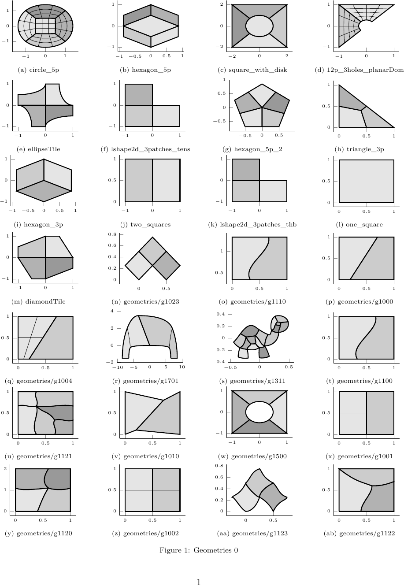

# `gsUnstructuredSplines`: Unstructured spline constructions for G+Smo


|CMake flags|```-DGISMO_OPTIONAL="<other submodules>;gsUnstructuredSplines"```|
|--:|---|
|License|[MPL 2.0](https://www.mozilla.org/en-US/MPL/2.0/)|
|OS support|Linux, Windows, macOS|
|Repository|[gismo/gismo/gsUnstructuredSplines](https://github.com/gismo/gsUnstructuredSplines)|
|Status|completed|
|Dependencies|[gismo/gismo](https://github.com/gismo/gismo)|
|Developer|[Pascal Weinmueller](https://github.com/weinmueller),[Hugo Verhelst](https://github.com/hverhelst),[Andrea Farahat](https://github.com/AndreaFarahat)|
|Maintainers|[pascal.weinmueller@mtu.de](mailto:pascal.weinmueller@mtu.de),[h.m.verhelst@tudelft.nl](mailto:h.m.verhelst@tudelft.nl)|
|Last checked|21-10-2022|

## Installation
```
cd path/to/build/dir
cmake . -DGISMO_OPTIONAL="<other submodules>;gsUnstructuredSplines"
make
```

---

## Module overview

The `gsUnstructuredSplines` module provides ready-to-use unstructured spline constructions for smooth multi-patch modelling. The module provides the following unstructured spline constructions:
- **Approximate $C^1$** (`gsApproxC1Spline`)
  > Weinmüller, P. (2022). Weak and approximate C1 smoothness over multi-patch domains in isogeometric analysis, [***PhD Thesis***](https://epub.jku.at/obvulihs/content/titleinfo/7811106)
  > 
  > Weinmüller, P., & Takacs, T. (2022). An approximate C1 multi-patch space for isogeometric analysis with a comparison to Nitsche’s method. [***Computer Methods in Applied Mechanics and Engineering***, 401, 115592.](https://doi.org/10.1016/j.cma.2022.115592)
  > 
  > Weinmüller, P., & Takacs, T. (2021). Construction of approximate $C^1$ bases for isogeometric analysis on two-patch domains. [***Computer Methods in Applied Mechanics and Engineering***, 385, 114017.](https://doi.org/10.1016/j.cma.2021.114017)

- **Analysis-Suitable $G^1$** (`gsC1SurfSpline`)
  > Farahat, A. (2023). Isogeometric Analysis with $C^1$-smooth functions over multi-patch surfaces, [***PhD Thesis***](https://epub.jku.at/obvulihs/id/8255939)
  > 
  > Farahat, A., Verhelst, H. M., Kiendl, J., & Kapl, M. (2023). Isogeometric analysis for multi-patch structured Kirchhoff–Love shells. [***Computer Methods in Applied Mechanics and Engineering***, 411, 116060.](https://doi.org/10.1016/j.cma.2023.116060)
  > 
  > Farahat, A., Jüttler, B., Kapl, M., & Takacs, T. (2023). Isogeometric analysis with C1-smooth functions over multi-patch surfaces. [***Computer Methods in Applied Mechanics and Engineering***, 403, 115706.](https://doi.org/10.1016/j.cma.2022.115706)

- **Almost - $C^1$** (`gsAlmostC1`)
- **Degenerate patches (D-Patches)** (`gsDPatch`)
- **Multi-Patch B-Splines with Enhanced Smoothness** (`gsMPBESSpline`)
  > Buchegger, F., Jüttler, B., & Mantzaflaris, A. (2016). Adaptively refined multi-patch B-splines with enhanced smoothness. [***Applied Mathematics and Computation***, 272, 159-172.](https://doi.org/10.1016/j.amc.2015.06.055)

## Implementation aspects
The general implementation of unstructured spline constructions is provided by the `gsMappedSpline` and `gsMappedBasis` classes. These classes define a global basis construction through a linear combination of local basis functions. The linear combination is stored in the `gsWeightMapper`. In general, a mapped basis is configured as follows:

**TO DO**

## Examples

<details>
<summary>Biharmonic equation</summary>

For more information, see the (Doxygen page)[url] corresponding to this file

</details>

<details>
<summary>Kirchhoff-Love shell model</summary>

For more information, see the (Doxygen page)[url] corresponding to this file

</details>

## Contributing to this module

## Publications based on this module

### Journal articles
1. Verhelst, H. M., Weinmüller, P., Mantzaflaris, A., Takacs, T., & Toshniwal, D. (2023). A comparison of smooth basis constructions for isogeometric analysis. ***arXiv preprint arXiv:2309.04405***.
1. Farahat, A., Verhelst, H. M., Kiendl, J., & Kapl, M. (2023). Isogeometric analysis for multi-patch structured Kirchhoff–Love shells. [***Computer Methods in Applied Mechanics and Engineering***, 411, 116060.](https://doi.org/10.1016/j.cma.2023.116060) 
1. Farahat, A., Jüttler, B., Kapl, M., & Takacs, T. (2023). Isogeometric analysis with C1-smooth functions over multi-patch surfaces. [***Computer Methods in Applied Mechanics and Engineering***, 403, 115706.](https://doi.org/10.1016/j.cma.2022.115706)
1. Weinmüller, P., & Takacs, T. (2022). An approximate C1 multi-patch space for isogeometric analysis with a comparison to Nitsche’s method. [***Computer Methods in Applied Mechanics and Engineering***, 401, 115592.](https://doi.org/10.1016/j.cma.2022.115592) 
1. Weinmüller, P., & Takacs, T. (2021). Construction of approximate $C^1$ bases for isogeometric analysis on two-patch domains. [***Computer Methods in Applied Mechanics and Engineering***, 385, 114017.](https://doi.org/10.1016/j.cma.2021.114017)
1. Buchegger, F., Jüttler, B., & Mantzaflaris, A. (2016). Adaptively refined multi-patch B-splines with enhanced smoothness. [***Applied Mathematics and Computation***, 272, 159-172.](https://doi.org/10.1016/j.amc.2015.06.055)

### PhD Theses
1. Verhelst, H.M. (2024). Isogeometric analysis of wrinkling, [***PhD Thesis***]() 
1. Farahat, A. (2023). Isogeometric Analysis with $C^1$-smooth functions over multi-patch surfaces, [***PhD Thesis***](https://epub.jku.at/obvulihs/id/8255939) 
1. Weinmüller, P. (2022). Weak and approximate C1 smoothness over multi-patch domains in isogeometric analysis, [***PhD Thesis***](https://epub.jku.at/obvulihs/content/titleinfo/7811106)
---

# Changelog

***

#### Geometries:


